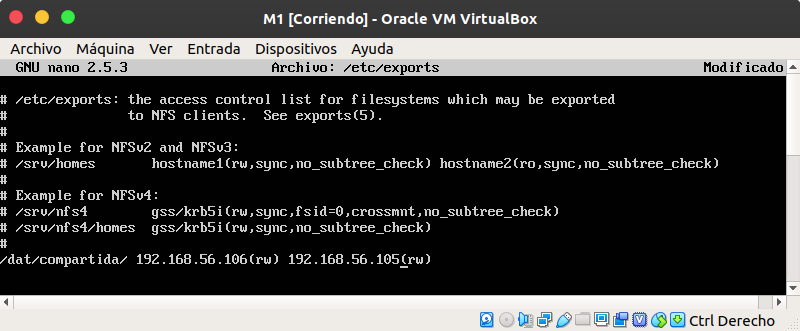

# Practica 6. Servidor de disco NFS
Realizada por Elena María Gómez Ríos y Guillermo Sandoval Schmidt.

## Objetivos
El objetivo principal de esta práctica es configurar un servidor NFS para exportar un
espacio en disco a los servidores finales (que actuarán como clientes-NFS).
Los objetivos concretos de esta práctica son:

1. Configurar una máquina como servidor de disco NFS y exportar una carpeta a
los clientes.
2. Montar en las máquinas cliente la carpeta exportada por el servidor.
3. Comprobar que la información que se escribe en una máquina en dicha carpeta
se ve actualizada en el resto de máquinas que comparten ese espacio.

## Configurar el servidor NFS
Instalamos las herramientas necesarias en la máquina M1 usando el comando:

	sudo apt-get install nfs-kernel-server nfs-common rpcbind

Creamos la carpeta que vamos a compartir, cambiando el propietario y dandole permisos usando:

	mkdir /dat/compartida
	sudo chown nobody:nogroup /dat/compartida/
	sudo chmod -R 777 /dat/compartida/

Debemos modificar el archivo de configuración */etc/exports*, añadiendo las IPs de nuestras máquinas con la línea:

	/dat/compartida/ 10.10.10.9(rw) 10.10.10.10(rw)

Para finalizar este paso, reiniciamos el servicio usando:

	sudo service nfs-kernel-server restart

## Configurar los clientes
A continuación, en ambas máquinas, deberemos instalar los paquetes necesarios, crear el punto de montaje entre máquinas y montar la carpeta remota usando en M1: 

	cd /home/gsandoval
	mkdir carpetacliente
	chmod -R 777 carpetacliente
	sudo mount 192.168.56.106:/dat/compartida carpetacliente

Y usaremos los mismos comandos en M2 más *sudo apt-get install nfs-common rpcbind*, ya que no habíamos instalado todavía las herramientas necesarias.

Finalmente, para automatizar el proceso, añadiremos al archivo de configuración */etc/fstab* la línea y reiniciamos las máquinas:

	192.168.56.106:/dat/compartida /home/gsandoval/carpetacliente nfs auto,noatime,nolock,bg,nfsvers=3,intr,tcp,actimeo=1800 0 0

Tras reiniciar las máquinas, podemos comprobar que funciona creando un archivo en la carpeta compartida desde una de las máquinas (en este caso en M2), pudiendo comprobar que es accesible desde la otra (en este caso M1) y viceversa, como se puede ver en la siguiente imagen:

